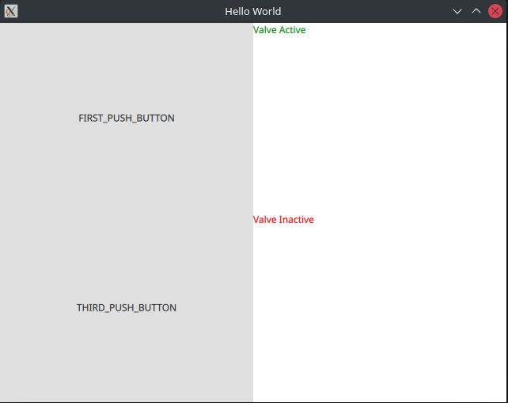

# Qt Example

Example of how to connect C++ classes to QML elements using pointers, custom classes, QML push button and QML text. Be aware of how you choose to NOTIFY the changes in your Q_PROPERTIES.

Enjoy!

